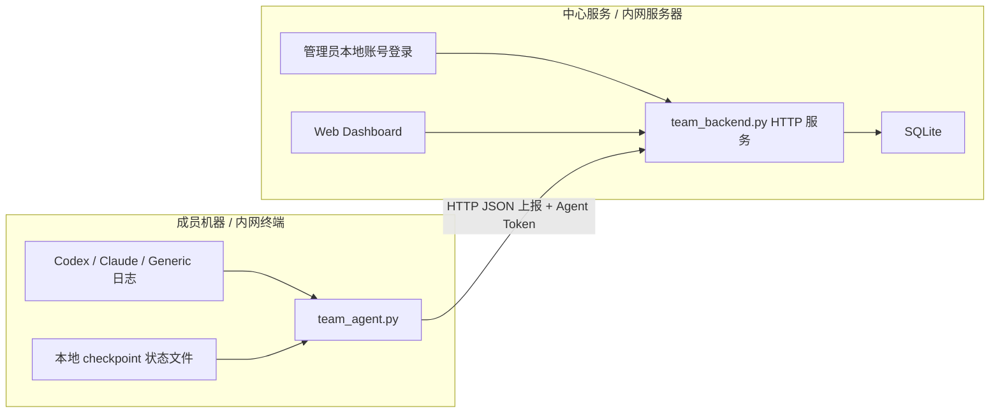

# Token Usage Universal Team Edition

一个面向中国内网环境的完整团队版 `token usage` 后台。

这版不是“大家各自跑命令看看自己用了多少”，而是一个真正能落地的团队产品：

- 有中心服务
- 有 SQLite 数据库
- 有团队后台页面
- 有本地账号登录
- 有设备级自动上报代理
- 不依赖百度、钉钉、GitHub、CDN、外部数据库托管

## 适用场景

- 公司内网里有多台开发机、跳板机、测试机
- 团队需要统一看谁在用、哪个项目最耗、哪些设备最重
- 网络隔离严格，不能依赖外部登录和外部 SaaS
- 希望先用轻量、可控、可审计的方式上线

## 目录结构

```text
token-usage-universal团队版/
├── README.md
├── docs/
│   └── ARCHITECTURE.md
├── examples/
│   └── team-usage.sample.jsonl
├── references/
│   └── schema.md
└── scripts/
    ├── team_agent.py
    ├── team_backend.py
    ├── team_common.py
    ├── team_token_usage.py
    ├── test_team_agent.py
    ├── test_team_backend.py
    └── test_team_token_usage.py
```

## 架构图



更详细的说明见 [`ARCHITECTURE.md`](/Users/guokeyu/AI/codex/token-usage-universal/token-usage-universal团队版/docs/ARCHITECTURE.md)。

## 核心组件

### 1. 中心服务

入口脚本：

- [`team_backend.py`](/Users/guokeyu/AI/codex/token-usage-universal/token-usage-universal团队版/scripts/team_backend.py)

职责：

- 初始化 SQLite 数据库
- 创建后台管理员账号
- 签发设备上报令牌
- 查看、禁用、重新启用设备令牌
- 执行 SQLite 在线备份
- 接收成员机器自动上报
- 提供 Web 后台和统计 API

### 2. 自动上报代理

入口脚本：

- [`team_agent.py`](/Users/guokeyu/AI/codex/token-usage-universal/token-usage-universal团队版/scripts/team_agent.py)

职责：

- 读取成员机器本地日志
- 依据 checkpoint 增量采集
- 自动推送到中心服务
- 支持一次运行和常驻循环两种模式

### 3. 兼容离线工具

入口脚本：

- [`team_token_usage.py`](/Users/guokeyu/AI/codex/token-usage-universal/token-usage-universal团队版/scripts/team_token_usage.py)

职责：

- 保留原来的文件同步式分析能力
- 适合离线导出、共享盘排查、无服务时兜底

## 数据库

中心服务默认使用 SQLite，路径默认是：

```text
token-usage-universal团队版/data/team_usage.db
```

SQLite 在这里不是“玩具数据库”，而是故意选的：

- 部署简单，内网机器几乎零门槛
- 备份容易，拷文件即可
- 不依赖外部运维系统
- 对几十到几百人团队的 usage 统计足够实用

如果以后数据量继续放大，再迁移到 Postgres 也很自然，因为事件模型和 API 已经稳定下来了。

## 登录与安全

### Web 后台登录

- 使用中心服务本地管理员账号
- 账号通过 `create-admin` 创建
- 密码使用 `PBKDF2-HMAC-SHA256` 哈希保存
- 登录后由服务端签发 session cookie

### Agent 上报认证

- 每台设备单独发一个 Agent Token
- Token 通过 `issue-agent-token` 创建
- 服务端只保存 token 哈希，不保存明文
- 每条上报事件最终都绑定到签发 token 对应的 `team_id / user_id / machine_id`

这意味着：

- 不需要百度、企业微信、钉钉、GitHub OAuth
- 纯内网就能跑
- 哪台机器在上报、属于谁，审计链路是清楚的

## 快速开始

### 1. 在中心服务器初始化数据库

```bash
python3 token-usage-universal团队版/scripts/team_backend.py init-db
```

### 2. 创建管理员账号

```bash
python3 token-usage-universal团队版/scripts/team_backend.py create-admin \
  --username admin \
  --password 'change-me-now'
```

### 3. 为某台成员机器签发上报令牌

```bash
python3 token-usage-universal团队版/scripts/team_backend.py issue-agent-token \
  --team-id platform \
  --user-id alice \
  --machine-id alice-mbp \
  --machine-label 'Alice MacBook Pro'
```

输出里会包含一段明文 token，设备端保存它即可。

### 4. 启动中心后台

```bash
python3 token-usage-universal团队版/scripts/team_backend.py run-server \
  --host 0.0.0.0 \
  --port 8787
```

打开：

```text
http://<内网IP>:8787/login
```

### 4.1 查看或禁用设备令牌

```bash
python3 token-usage-universal团队版/scripts/team_backend.py list-agent-tokens --team-id platform

python3 token-usage-universal团队版/scripts/team_backend.py disable-agent-token \
  --token-prefix tuat_xxxxx

python3 token-usage-universal团队版/scripts/team_backend.py enable-agent-token \
  --token-prefix tuat_xxxxx
```

适用场景：

- 某台机器丢失或离职，需要立刻停止上报
- 想盘点当前哪些设备 token 还在用
- 先暂停某台设备，排查后再恢复

### 4.2 执行数据库备份

```bash
python3 token-usage-universal团队版/scripts/team_backend.py backup-db
```

默认会把快照备份到：

```text
token-usage-universal团队版/data/backups/
```

也可以指定单独文件：

```bash
python3 token-usage-universal团队版/scripts/team_backend.py backup-db \
  --output /srv/backups/team_usage-20260331.db
```

这个备份是 SQLite 原生在线备份，不需要先停服务。

### 5. 在成员机器启动自动上报

```bash
export TOKEN_USAGE_GENERIC_LOG_GLOBS="$HOME/logs/openai/*.jsonl"

python3 token-usage-universal团队版/scripts/team_agent.py \
  --server-url http://10.0.0.8:8787 \
  --agent-token '上一步签发的token' \
  --team-id platform \
  --user-id alice \
  --machine-id alice-mbp \
  --machine-label 'Alice MacBook Pro' \
  run \
  --interval 300 \
  --bootstrap-last 24h
```

这条命令会：

- 首次补最近 24 小时
- 之后每 300 秒增量上报一次
- 自动记住上次成功同步到哪里

## 后台能看到什么

当前后台默认提供：

- 总 token / 有效 token / 缓存 token
- 活跃成员数
- 活跃设备数
- 活跃项目数
- 会话数 / 事件数 / 来源数
- 按成员排行
- 按项目排行
- 按来源排行
- 每日趋势
- 最近事件
- 已签发设备令牌及最近心跳

## 中国内网环境适配点

这版专门做了几件事，避免在国内内网里卡住：

- 不依赖外部登录
- 不依赖外部 JS/CSS CDN
- 不依赖 Docker 才能运行
- 不依赖 Redis、Kafka、云数据库
- 只要求 Python 3 和本地磁盘权限
- 常见运维动作可直接走本地 CLI，不依赖额外管理台

这意味着它很适合：

- 研发内网
- 金融 / 制造 / 政企隔离网
- 无公网出口或出口受限环境

## 生产强化现状

当前已经具备的生产强化能力：

- 管理员本地账号登录
- 设备级 Agent Token
- Token 查看 / 禁用 / 启用
- SQLite 在线备份

还没有做的更重能力：

- 多角色权限
- 告警通知
- 自动备份保留策略
- Postgres 迁移工具

## 自动化运行建议

### Linux systemd

中心服务：

```ini
[Unit]
Description=Token Usage Team Backend
After=network.target

[Service]
WorkingDirectory=/srv/token-usage-universal
ExecStart=/usr/bin/python3 token-usage-universal团队版/scripts/team_backend.py run-server --host 0.0.0.0 --port 8787
Restart=always

[Install]
WantedBy=multi-user.target
```

成员 Agent：

```ini
[Unit]
Description=Token Usage Team Agent
After=network.target

[Service]
WorkingDirectory=/srv/token-usage-universal
Environment=TOKEN_USAGE_GENERIC_LOG_GLOBS=/var/log/openai/*.jsonl
ExecStart=/usr/bin/python3 token-usage-universal团队版/scripts/team_agent.py --server-url http://10.0.0.8:8787 --agent-token xxx --team-id platform --user-id alice --machine-id alice-mbp run --interval 300 --bootstrap-last 24h
Restart=always

[Install]
WantedBy=multi-user.target
```

## 验证

已覆盖的验证包括：

```bash
python3 -m unittest token-usage-universal团队版/scripts/test_team_token_usage.py
python3 -m unittest token-usage-universal团队版/scripts/test_team_backend.py
python3 -m unittest token-usage-universal团队版/scripts/test_team_agent.py
```

## 下一步可扩展方向

- SQLite 升级到 Postgres
- 管理员多角色权限
- 设备在线状态告警
- 每日报表推送到企业微信 / 飞书内网网关
- 成本预算与阈值告警
- 项目维度配额
