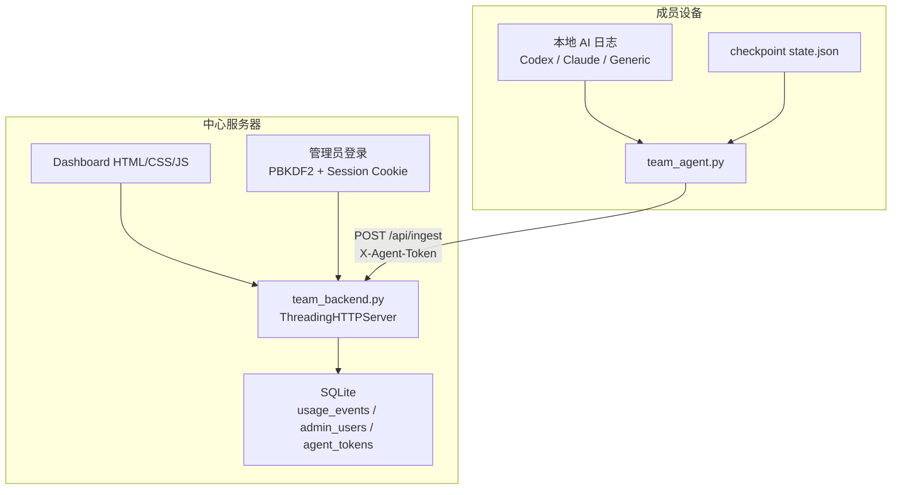

# Architecture

## 目标

在中国内网环境里提供一个可部署、可自动化、可审计的团队 token 使用统计系统。

核心原则：

- 纯内网运行
- 标准库优先
- 本地账号登录
- SQLite 落地存储
- 设备级令牌认证
- 增量自动上报

## 架构图

## 组件说明

### 1. Agent

入口：

- [`team_agent.py`](/Users/guokeyu/AI/codex/token-usage-universal/token-usage-universal团队版/scripts/team_agent.py)

工作方式：

1. 读取本地 checkpoint
2. 决定本次增量时间窗口
3. 调用现有个人版 adapter 采集本地 usage
4. 计算稳定 `event_id`
5. 通过 HTTP 上报到中心服务
6. 成功后更新 checkpoint

### 2. Backend

入口：

- [`team_backend.py`](/Users/guokeyu/AI/codex/token-usage-universal/token-usage-universal团队版/scripts/team_backend.py)

提供三类能力：

- 运维 CLI：初始化 DB、创建管理员、签发设备 token、查看/禁用/启用 token、执行在线备份
- API：接收上报、返回 dashboard 数据
- Web：本地登录页和统计后台

### 3. Database

核心表：

- `admin_users`
- `web_sessions`
- `agent_tokens`
- `usage_events`

其中 `usage_events` 是主事实表，按事件增量存储，不直接依赖外部账单 API。

## 为什么选 SQLite

不是因为它“简单”，而是因为它最适合这个场景：

- 内网部署门槛最低
- 无需额外 DBA 配置
- 审计和备份直观
- 小中型团队统计足够稳定
- 以后切 Postgres 时，事件层不会推倒重来

## 鉴权模型

### 管理员

- 本地用户名密码
- 密码哈希后入库
- 登录成功后签发 session cookie

### Agent

- 每台设备一个 Agent Token
- 服务端只存 token 哈希
- 事件入库时，`team_id / user_id / machine_id` 以 token 绑定身份为准

这比“客户端随便上报自己的 user_id”更稳，也更适合内网审计。

额外的运维控制：

- 设备丢失或人员变更时，可直接禁用对应 token，阻断后续上报
- 排查完成后可重新启用，不需要重装 Agent
- `list-agent-tokens` 可用于审计当前签发面

## 数据流

### 上报链路

1. Agent 读取本地日志
2. 转成团队统一事件
3. 带 `X-Agent-Token` 调 `POST /api/ingest`
4. Backend 验证 token
5. Backend 落 SQLite，按 `event_id` 去重

### 查询链路

1. 管理员登录后台
2. 浏览器请求 `/api/dashboard`
3. Backend 从 SQLite 聚合
4. 前端渲染卡片、排行、趋势、最近事件

## 自动化策略

当前自动化是“增量 + 幂等”：

- Agent 保存 `last_success_end`
- 下次从该时间继续采
- 服务端按 `event_id` 去重

这样即使 Agent 重试或服务端短暂失败，也不会把统计重复算爆。

## 备份策略

当前提供 SQLite 原生在线备份：

- 命令：`team_backend.py backup-db`
- 特点：不要求先停服务
- 默认落地：`data/backups/`
- 适合先做人工备份、定时任务或 systemd timer

这让团队版在不引入额外数据库系统的前提下，也有一个清晰、可验证的恢复点。

## 当前边界

已经实现：

- 数据库
- 后台
- 自动化上报
- 登录鉴权
- 内网兼容
- Token 生命周期管理
- SQLite 在线备份

暂未实现：

- 多角色权限
- 告警
- 自动备份保留策略
- Postgres 迁移工具
- 横向扩展
- 数据仓库级别分析
- 外部消息推送
